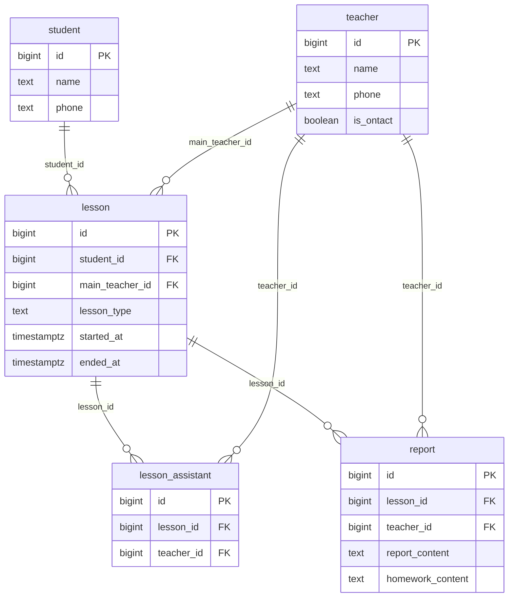

# 데이터베이스 설계

강쌤과외 수업 보고서 시스템의 DB 구조와 설계 기준을 정리한 문서다. DB는 PostgreSQL을 기준으로 하며, 로컬 PostgreSQL과 Supabase 모두 쓸 수 있다.

## 1. 요구사항 해석

과제 설명을 아래처럼 해석했고, 이 가정을 기준으로 DB를 설계했다.

- **Lesson은 수업 1회를 뜻한다.** 한 수업에 여러 선생님이 참여할 수 있어서 한 수업에 보고서가 여러 개 나올 수 있다. 같은 학생·같은 주 선생님의 수업도 회차마다 따로 쌓인다.
- **수업 종류는 정규(`regular`)와 온택트(`ontact`) 두 가지다.**
- **정규 수업은 주 선생님 1명과 보조 선생님 여러 명으로 구성될 수 있다.** 온택트 수업에는 보조 선생님이 없다고 가정한다. 이 문서의 보조 선생님은 과제 설명의 보충 선생님과 같다.
- **`is_ontact`가 true인 선생님은 온택트·정규 수업을 모두 맡을 수 있다.** false인 선생님은 온택트 수업 보고서를 쓸 수 없다.
- **수업 종류와 시작·종료 시간은 수업을 만들 때 들어가 있다.** 보고서를 쓸 때 수업 종류는 바꿀 수 없고, 시작·종료 시간은 입력하면 수업의 값이 수정된다. 누가 수정할 수 있는지(보조 선생님은 수정 불가)는 DB가 아니라 앱 권한 처리에서 다룬다.

## 2. 과제 필수 스키마에서 바꾼 점

| 변경 | 이유 |
|---|---|
| `lesson_type`을 report에서 lesson으로 옮김 | 수업 종류에 따라 보조 선생님 유무와 +1 여부가 정해지므로 수업 단위 값이다. 보고서마다 두면 같은 수업의 보고서끼리 종류가 달라질 수 있고, 보조 선생님을 붙일 때 수업 종류를 확인할 수 없다. |
| `started_at`, `ended_at`을 report에서 lesson으로 옮김 | lesson이 수업 1회이므로 시간도 수업의 값이다. 같은 학생·같은 주 선생님의 수업이 여러 개 쌓여도 날짜로 구분할 수 있다. |
| `lesson_assistant` 테이블 추가 | 보조 선생님과 수업의 관계(N:M)를 별도 테이블로 나눴다. 과제의 선택 구현 항목이다. |

## 3. ERD



## 4. 테이블 구조

### teacher — 선생님

| 컬럼 | 타입 | 제약 | 설명 |
|---|---|---|---|
| id | bigint | PK, 자동 증가 | |
| name | text | NOT NULL | 이름 |
| phone | text | NOT NULL, CHECK (숫자만) | 전화번호. 하이픈 없이 저장한다. |
| is_ontact | boolean | NOT NULL, 기본값 false | true면 온택트·정규 수업 모두, false면 정규 수업만 가능 |

- `UNIQUE (name, phone)`: 로그인 기준(이름 + 전화번호)과 맞춘다.

### student — 학생

| 컬럼 | 타입 | 제약 | 설명 |
|---|---|---|---|
| id | bigint | PK, 자동 증가 | |
| name | text | NOT NULL | 이름 |
| phone | text | NOT NULL, CHECK (숫자만) | 전화번호. 하이픈 없이 저장한다. |

- `UNIQUE (name, phone)`: 부모님 번호를 동시에 사용하는 경우를 고려해 전화번호 단독이 아니라 이름과 묶는다.

### lesson — 수업 1회

| 컬럼 | 타입 | 제약 | 설명 |
|---|---|---|---|
| id | bigint | PK, 자동 증가 | |
| student_id | bigint | NOT NULL, FK → student.id | 수업을 받는 학생 |
| main_teacher_id | bigint | NOT NULL, FK → teacher.id | 주 선생님 (수업당 1명) |
| lesson_type | text | NOT NULL, CHECK (`regular`, `ontact` 중 하나) | 수업 종류 |
| started_at | timestamptz | NOT NULL | 수업 시작 시각 |
| ended_at | timestamptz | NOT NULL, CHECK (ended_at > started_at) | 수업 종료 시각 |

### lesson_assistant — 수업별 보조 선생님

| 컬럼 | 타입 | 제약 | 설명 |
|---|---|---|---|
| id | bigint | PK, 자동 증가 | |
| lesson_id | bigint | NOT NULL, FK → lesson.id, ON DELETE CASCADE | 수업이 지워지면 같이 지워진다. |
| teacher_id | bigint | NOT NULL, FK → teacher.id | 보조 선생님 |

- `UNIQUE (lesson_id, teacher_id)`: 같은 수업에 같은 보조 선생님이 두 번 들어가지 않는다.
- 보조 선생님 한 명당 한 행이다. 배열 대신 행으로 나눠서 FK와 UNIQUE를 DB에서 걸 수 있게 했다.

### report — 수업 보고서

| 컬럼 | 타입 | 제약 | 설명 |
|---|---|---|---|
| id | bigint | PK, 자동 증가 | |
| lesson_id | bigint | NOT NULL, FK → lesson.id | 보고서가 달린 수업은 지울 수 없다 (ON DELETE 기본값). |
| teacher_id | bigint | NOT NULL, FK → teacher.id | 작성 선생님 |
| report_content | text | NOT NULL | 보고서 내용 |
| homework_content | text | NULL 허용 | 숙제 내용. 숙제가 없는 날을 고려했다. |

- `UNIQUE (lesson_id, teacher_id)`: 한 선생님은 한 수업에 보고서를 하나만 쓴다. 주 선생님 보고서가 두 번 세지는 것도 이걸로 막는다.

## 5. 규칙을 지키는 위치

한 테이블 안에서 확인할 수 있는 규칙은 DB 제약(PK, FK, NOT NULL, UNIQUE, CHECK)으로 막는다. 다른 테이블을 봐야 하는 규칙은 CHECK로 걸 수 없어 트리거가 필요한데, 과제 범위를 고려해 트리거 대신 저장 코드(서버)에서 검증한다.

| 저장 대상 | 저장 코드에서 확인하는 규칙 |
|---|---|
| lesson | `lesson_type`이 `ontact`면 주 선생님의 `is_ontact`가 true여야 한다. |
| lesson | `lesson_type`을 `ontact`로 바꿀 때 그 수업에 보조 선생님이 없어야 한다. |
| lesson_assistant | 그 수업의 주 선생님은 보조 선생님으로 넣을 수 없다. |
| lesson_assistant | `lesson_type`이 `regular`인 수업에만 넣을 수 있다. |
| report | 작성자는 그 수업의 주 선생님이거나 보조 선생님이어야 한다. |
| report | 보고서를 쓸 때 입력한 수업 시간은 lesson에 반영된다. 수업 종류는 보고서에서 바꿀 수 없다. |

이 규칙들이 함께 지켜지면 온택트 수업의 보고서는 `is_ontact`가 true인 주 선생님만 쓸 수 있다. 그래서 "`is_ontact`가 false인 선생님은 온택트 수업 보고서를 쓸 수 없다"는 조건은 따로 검사하지 않아도 지켜진다.

## 6. 수업 완료 횟수 계산

**기준**: 정규 수업에서 그 수업의 주 선생님이 쓴 보고서만 +1. 온택트 수업 보고서와 보조 선생님 보고서는 +0.

```sql
SELECT COUNT(*) AS completed_count
FROM report r
JOIN lesson l ON l.id = r.lesson_id
WHERE l.student_id = :student_id          -- 조회할 학생
  AND l.lesson_type = 'regular'           -- 정규 수업만
  AND r.teacher_id = l.main_teacher_id;   -- 주 선생님이 쓴 보고서만
```

- report의 `UNIQUE (lesson_id, teacher_id)` 때문에 한 수업은 많아야 1회로 센다.
- 누적 횟수는 컬럼으로 저장하지 않고 조회할 때 계산한다. 보고서가 추가되거나 수업 종류가 바뀌어도 따로 맞춰야 할 값이 없다.

## 7. 추후 추가

- 한 수업에 보고서가 여러 개일 때 학생 화면에 보여줄 AI 병합 결과를 저장하는 구조는 추가 기능으로 나중에 덧붙인다.

## 8. 적용 방법

| 파일 | 내용 |
|---|---|
| `schema.sql` | 테이블을 만든다. 다시 실행하면 테이블을 지우고 새로 만든다. |
| `seed.sql` | 테스트 데이터를 넣는다. 다시 실행하면 데이터를 처음 상태로 되돌린다. |

프로젝트 루트에서 실행한다.

```bash
createdb kangsam
psql kangsam -f db/schema.sql
psql kangsam -f db/seed.sql
```
